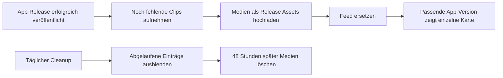

# Feature-Videos

Implementiert am 23. September 2026. Der ursprüngliche Cloudflare-Plan wurde auf Wunsch durch kostenlose GitHub Release Assets ersetzt. Keine Cloudflare-Ressourcen, Domains, externen Konten oder zusätzlichen Secrets sind erforderlich.

## Verhalten in der App

Wichtige Features erscheinen einzeln in einer schließbaren Karte unten rechts. Nach zehn Sekunden und einer Bedienpause startet höchstens ein Clip pro Sitzung automatisch stumm. Texteingabe, Onboarding, Tour, Dialoge und dringende Meldungen haben Vorrang. Eine manuell pausierte Wiedergabe bleibt nach einem Dialog pausiert. Bei reduziertem Bewegungswunsch startet das Video erst nach einem Klick.

Die Karte bietet Pause, Fortschritt, Wiederholung, Vergrößern und eine Navigation zur Funktion. Nach Ende lässt sich das nächste Feature ausdrücklich öffnen. Schließen verhindert eine erneute automatische Vorstellung dieses Features; eine neue Medienrevision setzt den Zustand nicht zurück. Release Notes enthalten unter „Kurz gezeigt“ alle noch aktuellen, zur Installation passenden Clips zum manuellen Wiederansehen. Die automatische Vorstellung lässt sich unter Einstellungen → Über & Updates abschalten.

Die Auswahl berücksichtigt die tatsächliche installierte Semver-Version, Plattform, Easy Mode, gegebenenfalls Datenbank-Capabilities und Ablaufdatum. Lokale Dev-Builds starten keine automatischen Vorstellungen. Unbekannte App-Versionen und Pre-Releases werden ausgeschlossen. Netzwerk-/Codecfehler beeinträchtigen die Arbeit nicht; die Karte bietet die Text-Release-Notes als Rückweg.

## Kostenlose Speicherung

Medien liegen im bestehenden öffentlichen Repository `Leon-Achteresch/l8db`. Jeder Clip erhält einen eigenen Pre-Release `feature-video-<id>-<revision>` mit MP4, WebM und JPEG. Der zentrale Pre-Release `feature-videos` enthält nur den JSON-Feed im Beschreibungstext. Alle Medien-Releases werden ausdrücklich niemals als „latest“ markiert und sind keine App-Updates. GitHub dokumentiert für Releases keine Begrenzung der gesamten Größe oder Download-Bandbreite; einzelne Dateien müssen unter 2 GiB bleiben. Unsere Grenze beträgt 5 MB je Videoformat. [GitHub Releases](https://docs.github.com/en/repositories/releasing-projects-on-github/about-releases)

Der kleine JSON-Feed steht im Body des zentralen Releases `feature-videos`. Die App liest ihn über die öffentliche GitHub-API ohne Token, mit einem persistenten Prüfintervall von sechs Stunden und einem achtsekündigen Timeout. Eine manuelle Aktualisierung ist höchstens einmal pro Minute möglich. Ein gültiger gespeicherter Feed überbrückt einen kurzen Ausfall; nach spätestens 48 Stunden ohne Erneuerung werden keine Clips mehr angeboten. Bei API-Limits bleiben die Text-Release-Notes nutzbar. Öffentliche API-Anfragen unterliegen GitHubs Limit pro IP. [GitHub API-Limits](https://docs.github.com/en/rest/using-the-rest-api/rate-limits-for-the-rest-api)

Im Git-Repository liegen ausschließlich Code, Demo-Szenarien und Beschreibungen. Aufnahmen werden unter `test-artifacts/feature-videos/` erzeugt; dieser Ordner ist bereits ignoriert. Die App bündelt keine Videodateien und lädt nur das ausgewählte Format des geöffneten Clips. Sie legt kein eigenes Medienarchiv an und gibt beim Schließen die Quelle und den Decoder frei. HTTP-Caches von GitHub und WebView kontrolliert die App nicht; bereits ausgelieferte Kopien können nicht zurückgerufen werden.

Die App-Releases dieses Repositorys sind unveränderlich. Diese Sicherheitsfunktion bleibt aktiv: GitHub erlaubt weiterhin Änderungen an Release-Beschreibungen und das Löschen eines vollständigen Releases. Darauf basiert die Aufteilung in einen reinen Metadaten-Release und einzelne Clip-Releases. Es werden keine einzelnen Assets eines veröffentlichten Releases verändert oder gelöscht. [Unveränderliche Releases](https://docs.github.com/en/code-security/concepts/supply-chain-security/immutable-releases)

## Erste Videos und Produktion

Zwei Szenarien sind enthalten:

| Feature | Inhalt | Ursprung auf main |
| --- | --- | --- |
| Easy Mode | Vereinfachten Modus in den Einstellungen einschalten | `64b344ea`, 0.6.128 |
| Extension-Markt | Offiziellen Katalog und den Bereich für Berechtigungen zeigen | `8aeb1658`, 0.6.132 |

Die Aufnahmen verwenden die gebaute echte React-App und vorbereitete Demo-Daten. Der Extension-Katalog wird vor der Aufnahme geladen und für den Ablauf eingefroren; es wird keine Erweiterung installiert. Playwright zoomt während der Bedienung auf die tatsächlichen Bedienelemente und führt die Kamera anschließend zum nächsten Bereich. Die eingeblendeten Texte bleiben dabei an ihrer Position. FFmpeg erzeugt MP4/H.264, WebM/VP9 und ein JPEG-Standbild. Die Clips haben keine Audiospur. Größe, Dauer und Encoding werden geprüft; die Rohaufnahme wird nach erfolgreichem Export gelöscht. [Playwright-Aufnahmen](https://playwright.dev/docs/videos), [FFmpeg](https://ffmpeg.org/ffmpeg-formats.html)

Voraussetzungen für lokale Aufnahmen: Bun 1.3.10, Playwright Chromium und FFmpeg mit H.264-, VP9- und JPEG-Encoder. Veröffentlichung/Cleanup benötigen zusätzlich `gh` mit Repository-Schreibrecht. Die App benötigt keinen GitHub-Login.

```sh
bun install --frozen-lockfile
bunx playwright install chromium
bun run build
bun run feature-videos:record
```

Ergebnisse: `test-artifacts/feature-videos/fv-<id>-<revision>.mp4`, `.webm`, `.jpg` und `rendered.json`. `FEATURE_VIDEO_IDS='["easy-mode"]'` beschränkt die Aufnahme. Aufnahmen aus einem veränderten Arbeitsverzeichnis sind Vorschauen und werden vom Publisher nicht akzeptiert.

Ein neues wichtiges Feature benötigt einen Eintrag in `scripts/feature-videos/catalog.json` und ein echtes Aufnahmeszenario in `record.ts`. Die stabile ID darf nicht für einen anderen Inhalt wiederverwendet werden; bei neuer Aufnahme `revision` erhöhen. Commit und erste App-Version dokumentieren. Kleine Fehlerkorrekturen erhalten kein Video. Vor dem Merge die erzeugten Clips bei 360 px Breite und vergrößert prüfen. Neue Szenarien sollten ungefähr 12–25 Sekunden dauern, maximal 30 Sekunden.

## Veröffentlichung



`.github/workflows/release.yml` ruft den wiederverwendbaren Medienworkflow nach erfolgreichem `finalize` auf. Dieser checkt den veröffentlichten Tag aus, nimmt nur neue IDs oder Revisionen auf und verwendet ausschließlich den vorhandenen `GITHUB_TOKEN`. In öffentlichen Repositories sind Standard-GitHub-hosted Runner kostenlos; es werden keine kostenpflichtigen großen Runner oder zusätzlichen Artifact-Speicher verwendet. Temporäre Medien entfernt der Job auch bei Fehlern. [GitHub Actions Abrechnung](https://docs.github.com/en/billing/concepts/product-billing/github-actions)

Der Publisher gleicht Aufnahme-Commit, stabilen Release-Tag und Feature-Commit ab. Das Video erhält die veröffentlichte App-Version als Mindestversion, damit seine Darstellung zur installierten Oberfläche passt. Er prüft alle Dateien vor der Veröffentlichung, erstellt jeden Clip-Release als Entwurf, lädt alle drei Medien hoch und veröffentlicht danach diesen Release. Erst anschließend ersetzt er den zentralen Feed. Ein Medienfehler macht einen bereits veröffentlichten App-Release nicht rückgängig. Workflow und täglicher Cleanup sind über dieselbe Concurrency-Gruppe serialisiert.

Manuell in GitHub Actions den Workflow „Feature videos“ mit einem veröffentlichten Tag starten. Ohne Tag wird nur aufgeräumt. Lokal:

```sh
bun run feature-videos:plan
bun scripts/feature-videos/publish.ts publish v0.6.150 test-artifacts/feature-videos
bun run feature-videos:cleanup
```

Die Versionsnummer ist ein Beispiel und muss durch einen tatsächlich veröffentlichten Tag ersetzt werden. Der Aufnahme-Checkout muss genau zu diesem Tag gehören und sauber sein. Gelöschte unveränderliche Release-Tags können nicht wiederverwendet werden; nach einem bereinigten Fehlversuch eine neue Revision wählen. Dateien werden nicht überschrieben: Ein identischer, bereits hochgeladener SHA-256-Inhalt kann beim Wiederholen übernommen werden, ein anderer Inhalt verlangt eine neue Revision. Falls ein Workflow wegen Teil-Uploads fehlschlägt, dieselben Exporte erneut verwenden oder die Revision erhöhen und neu aufnehmen.

## Ablauf und Löschung

- Höchstens sechs aktive Clips, höchstens 90 Tage ab erster Videoveröffentlichung. Eine neue Revision verlängert diesen Zeitraum nicht.
- Höchstens drei passende Clips werden für automatische Vorstellungen berücksichtigt; alle sechs bleiben bei Eignung manuell erreichbar.
- Täglich um 05:23 UTC und nach Veröffentlichung wird der Feed erneuert. Abgelaufene oder verdrängte Clips verschwinden zuerst aus dem Feed. Die App prüft die Daten ebenfalls selbst.
- 48 Stunden nach Entfernung wird der gesamte zugehörige Clip-Release samt Videoformaten und Vorschaubild gelöscht. Auch verwaiste Clip-Entwürfe werden nach 48 Stunden entfernt. Es werden ausschließlich Releases mit passendem `feature-video-`-Tag und eigener JSON-Kennzeichnung bereinigt. Aktive Referenzen und App-Releases werden niemals gelöscht.
- Das kleine Veröffentlichungsregister im Release-Body merkt sich bereits veröffentlichte IDs und ihre erste Veröffentlichung. Dadurch werden abgelaufene Clips bei späteren App-Releases nicht erneut produziert. Löschmarkierungen verschwinden, sobald ihre Dateien entfernt sind.
- Beschädigte Register oder fehlende aktive Dateien stoppen die Bereinigung. Der Workflow meldet den Fehler; der Client blendet einen abgelaufenen Feed aus. GitHub-Zeitpläne sind kein minutengenauer Dienst. Bei deaktivierten Actions bleibt die physische Bereinigung bis zum nächsten erfolgreichen Lauf aus.
- Lokale Gesehen-/Geschlossen-Zustände werden nach 120 Tagen bereinigt und auf 100 Einträge begrenzt. Nur diese Metadaten und der kleine Feed werden gespeichert.

Es gibt kein dauerhaftes Videoarchiv. Text-Release-Notes bleiben erhalten. Die App kann keine bereits von Nutzern separat gespeicherten Dateien entfernen.

## Technische Einbindung und Prüfungen

- Globaler Host in `src/routes/__root.tsx`; UI-Komponenten unter `src/features/updates/`.
- Feed-Vertrag, Auswahl, persistenter Zustand und Laden unter `src/lib/feature-videos/`.
- Getrennte CSP-Freigaben nur für den GitHub-Download-Pfad dieses Repositorys und GitHubs Asset-CDN. Keine neuen Tauri-Kommandos, keine Remote-Skripte, keine beliebigen Aktions-URLs. Die Extension-Isolation bleibt bestehen.
- `scripts/feature-videos/retention.ts` enthält die getrennt testbaren Ablauf-/Löschregeln.
- Szenarien, CI-Veröffentlichung, Cleanup und lokale Vorschauen sind vollständig im Repo reproduzierbar; echte native Betriebssystemdialoge sind in den ersten Clips nicht erforderlich.

```sh
bun run check
bun run build
bun run production:check
bun test tests/feature-videos.test.ts
L8DB_FEATURE_VIDEO_BROWSER=1 bun test tests/feature-video-browser.test.ts
L8DB_FEATURE_VIDEO_BROWSER=webkit bun test tests/feature-video-browser.test.ts
L8DB_PRODUCTION_BROWSER=1 L8DB_EXTENSION_BROWSER=1 bun test tests/production-browser.test.ts tests/extension-browser.test.ts
L8DB_PRODUCTION_BROWSER=webkit L8DB_EXTENSION_BROWSER=webkit bun test tests/production-browser.test.ts tests/extension-browser.test.ts
```

Die Browsertests verwenden ein zur Laufzeit erzeugtes Testvideo und die gebaute App unter Produktions-CSP. Sie prüfen unter anderem stummes Autoplay, keine Vorabdownloads, Dialogpriorität, manuelles Pausieren, Schließen über Neustarts hinweg, manuelles Wiederansehen, kleine Fenster und reduzierte Bewegung. Die GitHub-CI führt beide Engines aus. Native Windows-/Linux-WebViews können andere Decoder haben; dafür steht zusätzlich WebM bereit. Native Plattformtests sind durch Browserprüfungen nicht vollständig ersetzt.

Die Veröffentlichung wird mit dem nächsten App-Release nach Integration dieser Änderungen auf `main` aktiv. Ein lokaler Commit allein startet keine GitHub Workflows und veröffentlicht keine Dateien.
