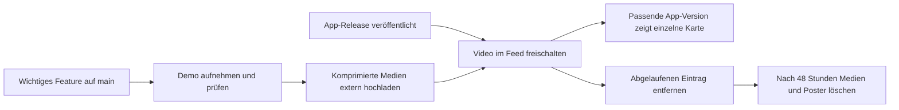

# Plan: Neue Features als kurze Videos

Stand: 23. September 2026. Status: Planung, noch keine Implementierung oder Infrastruktur angelegt.

Wichtige, auf `main` integrierte und veröffentlichte Features erscheinen einzeln in einer modernen Videokarte unten rechts. Vom Nutzer festgelegt: automatisch stumm abspielen, jederzeit schließbar. Die weiteren Zahlen und Regeln sind vorgeschlagene Startwerte.



## Produktverhalten

- Eine Karte, ein Feature, ein klarer Nutzen. Clipdauer 12–25 Sekunden, höchstens 30 Sekunden.
- Etwa 360 px breite Karte mit 16:9-Video, kleinem „Neu“-Badge, Titel, einem Satz Erklärung, Pause, Vergrößern und sichtbarem Schließen-Button. Breite an das Fenster anpassen; die App unterstützt mindestens 760 × 560 px.
- 16 px Abstand zur rechten Kante und zur Oberkante der Statusleiste. Bestehende Theme-Farben, feiner Rahmen, weicher Schatten, 16 px Ecken. Dezentes Einblenden mit kleiner Bewegung, keine dauernden Effekte.
- Nach dem App-Start frühestens nach zehn Sekunden und einer kurzen Bedienpause anzeigen. Nicht während Onboarding, Tour, Dialogen oder einer laufenden Eingabe einblenden. Nach einem Update erst nach dem Neustart in der tatsächlich installierten Version.
- Genau ein automatisch gestarteter Clip pro Sitzung. Weitere passende Features über „Nächstes Feature“ einzeln ansehen; ungesehene Clips können in späteren Sitzungen erscheinen. Kein automatisches Durchspielen einer langen Playlist.
- Kein Loop. Am Ende bleibt eine kompakte Abschlussansicht mit „Noch einmal“, „Nächstes Feature“ und optional „Feature öffnen“. Ein Feature öffnen darf nur navigieren, keine Daten ändern oder Erweiterungen installieren.
- Schließen beendet Wiedergabe und Downloads sofort und unterdrückt das aktuelle Feature dauerhaft für automatische Vorstellungen. In dieser Sitzung startet danach kein anderer Clip automatisch.
- Unter Release Notes gibt es „Neue Features“ zum erneuten Abspielen noch verfügbarer Videos. In Einstellungen lassen sich automatische Feature-Videos abschalten.
- Fokus bleibt im aktuellen Arbeitsbereich. Karte per Tastatur erreichbar, Pause und Schließen beschriftet; Escape schließt nur bei Fokus innerhalb der Karte. Bei reduziertem Bewegungswunsch zunächst Standbild mit Play anbieten.
- Bei ausgeblendeter App, geöffneten Dialogen oder dringenden Toasts pausieren und Karte ausblenden. Nach Rückkehr nur fortsetzen, wenn sie nicht manuell pausiert oder geschlossen wurde. Normale Toasts erhalten Platz oberhalb der Karte.

Technisch ein natives HTML-Video mit `muted`, `playsInline` und behandeltem `play()`-Ergebnis. Bei blockiertem Autoplay erscheint das Standbild mit Play. Das Verhalten muss in den tatsächlichen Tauri-WebViews geprüft werden. [Autoplay-Dokumentation](https://developer.mozilla.org/en-US/docs/Web/Media/Guides/Autoplay)

## Welche Features erhalten ein Video?

Pro Veröffentlichung null bis drei bewusst ausgewählte Highlights. Geeignet sind neue Arbeitsabläufe, spürbare Zeitersparnis und schwer auffindbare Funktionen. Kleine Korrekturen, interne Umbauten und reine Versionsanhebungen bleiben in den Release Notes. Ein `feat`-Commit allein löst kein Video aus.

Eine kleine Beschreibung pro Highlight enthält stabile Feature-ID, Nutzen, Reihenfolge, Aufnahmeablauf und zugehörigen Commit. Beim Veröffentlichen wird die tatsächliche Release-Version ergänzt. Ein Review prüft Nutzen, fachliche Richtigkeit und Lesbarkeit des Clips. Die App wertet weder Git-Historie noch PR-Titel aus.

Erste Kandidaten aus dem lokal vorhandenen `main`; Release-Zuordnung vor Produktion gegen den veröffentlichten Tag prüfen:

| Kandidat | Aufnahmeszenario | Nachweis in lokalem `main` |
| --- | --- | --- |
| Verifizierter Extension Market | Markt öffnen, Erweiterung suchen, Details und Verifizierung zeigen | `8aeb1658`, Changelog 0.6.132 |
| Easy Mode | Modus wechseln und die vereinfachte Navigation zeigen | `64b344ea`, Changelog 0.6.128 |
| Tabellendaten vergleichen | Zwei vorbereitete Snapshots vergleichen und eine Änderung zeigen | `08b72c9f`, Changelog 0.6.128 |

Für den ersten Durchlauf einen Clip vollständig produzieren und in der App prüfen, danach die beiden anderen. Die bereits vorhandenen Highlights dürfen beim ersten Start dieser Funktion einmalig als aktuelle Auswahl erscheinen; es wird keine historische Video-Warteschlange aufgebaut.

## Videos produzieren

Empfehlung: echte App-Oberfläche mit reproduzierbaren Demo-Daten aufnehmen. Pro Clip dasselbe kurze Muster: Nutzen zeigen, zwei bis drei Aktionen, sichtbares Ergebnis. Große, lesbare Ausschnitte statt einer winzig skalierten kompletten Datenbankoberfläche. Cursorbewegungen ruhig; erklärende Texte kurz und ohne Ton verständlich.

1. Den veröffentlichten Commit oder den konkreten Release-Kandidaten auschecken. Feste Fenstergröße und Theme verwenden; nur erfundene Daten und Verbindungen einsetzen.
2. Ein Playwright-Szenario öffnet die echte gebaute React-Oberfläche und führt den Ablauf aus. Vorhandene Browser-Fixtures wie `tests/fixtures/perf-app.ts` liefern ein Muster für kontrollierte Tauri-Antworten. Jede Feature-Aufnahme benötigt fachlich passende Fixtures; native Funktionen zusätzlich gegen die Desktop-App prüfen.
3. Viewport und Aufnahmegröße explizit auf 1280 × 720 setzen. Lesbarkeit durch passenden Ausschnitt oder UI-Zoom sichern. Playwright unterstützt Videoaufnahmen und speichert sie beim Schließen des Browser-Kontexts. [Playwright-Videos](https://playwright.dev/docs/videos)
4. Native Betriebssystemdialoge oder Treiberinstallationen bei Bedarf direkt in der Desktop-App aufnehmen. Die Aufnahme danach durch dieselbe Verarbeitung schicken. Dieser Weg ist auch für den ersten Pilotclip geeignet.
5. Mit FFmpeg schneiden und nach MP4/H.264 mit `yuv420p`, 24 oder 30 fps, ohne Audiospur und mit `faststart` exportieren. `faststart` legt die MP4-Metadaten für einen früheren Wiedergabestart nach vorn. Zusätzlich eine WebM/VP9-Variante für Plattformen ohne passenden H.264-Decoder und ein WebP-Standbild erzeugen. [FFmpeg-Formatdokumentation](https://ffmpeg.org/ffmpeg-formats.html)
6. Ziel pro Videoformat: 1–3 MB, feste Obergrenze 5 MB; Standbild höchstens 100 KB. Bei überschrittener Grenze zuerst Schnitt und Ausschnitt verbessern, danach Kompression. Dateigröße und Codec mit `ffprobe` prüfen.
7. Vorschau in Originalgröße der Karte und vergrößert ansehen. Ablauf, Texte, Demo-Daten und Plattformkompatibilität prüfen; erst dann veröffentlichen.

Im Repo bleiben nur Aufnahme-Skripte, Demo-Fixtures und kleine Text-/JSON-Beschreibungen. Rohaufnahmen und Exporte kommen in ignorierte Arbeitsverzeichnisse. Temporäre CI-Vorschauen erhalten sieben Tage Aufbewahrung. Keine Videodateien in Git, Git LFS oder im App-Bundle. Aktuell sind keine MP4-, WebM-, MOV- oder GIF-Dateien in Git erfasst; eine Bereinigung der Git-Historie ist daher für diese Dateitypen nicht erforderlich.

## Hosting und Auslieferung

Empfehlung: separater Cloudflare-R2-Bucket mit eigener HTTPS-Domain, beispielsweise `media.l8db.leon-achteresch.de`. Die Domain ist ein Vorschlag und noch nicht eingerichtet. R2 unterstützt eine eigene Domain für öffentliche Auslieferung mit Cloudflare-Cache; `r2.dev` dient der Entwicklung. R2 berechnet Speicher und Operationen, direkte R2-Auslieferung hat keine Egress-Gebühren. [Eigene Domain](https://developers.cloudflare.com/r2/buckets/public-buckets/), [R2-Preise](https://developers.cloudflare.com/r2/pricing/)

| Möglichkeit | Bewertung für diese Funktion |
| --- | --- |
| R2 und eigene Domain | Empfehlung: getrenntes Medienlager, automatisierbares Löschen, kontrollierte Auslieferung |
| Bestehender Webserver und eigener Medienpfad | Alternative, falls Speicher, HTTP-Range-Auslieferung und täglicher Löschjob dort bereits betreut werden |
| Videos im Repo oder App-Bundle | Vergrößert Git-Historie beziehungsweise jeden Download; erfüllt das Speicherziel nicht |

Bei sechs aktiven Clips und zwei Formaten à maximal 5 MB sind ungefähr 60 MB aktive Videodaten erforderlich, zuzüglich Standbilder und kurzer Übergangsbestände. Die App lädt nur das benötigte Format des sichtbaren Clips. Bandbreite und laufende Kosten hängen von Aufrufen, Wiederholungen und Cache-Treffern ab.

Vorgesehene Objekte:

```text
feed/v1.json
clips/<feature-id>/<revision>/demo.mp4
clips/<feature-id>/<revision>/demo.webm
clips/<feature-id>/<revision>/poster.webp
```

Der kleine Feed enthält nur aktive Highlights und maximal sechs Einträge. Neue Mediendateien erhalten neue Revisionspfade. Erst Dateien hochladen und prüfen, danach den Feed als Ganzes ersetzen. Fehlgeschlagene Uploads werden nie referenziert. Veröffentlichung und Cleanup nutzen dieselbe Serialisierung, damit sie sich nicht gegenseitig überschreiben.

Das geplante Feed-Schema enthält:

| Feld | Zweck |
| --- | --- |
| `schemaVersion`, `generatedAt`, `validUntil` | Schema-Erkennung und begrenzte Gültigkeit; Feed maximal 24 Stunden gültig |
| `id`, `revision`, `title`, `summary`, `priority` | Stabile Identität, Inhalt und redaktionelle Reihenfolge |
| `releaseVersion`, `sourceCommit`, `minAppVersion`, optional `maxAppVersionExclusive` | Release-Nachweis und Kompatibilität bei später veränderter UI |
| `publishedAt`, `expiresAt` | Sichtbarkeitsfenster, höchstens 90 Tage ab Erstveröffentlichung |
| `platforms`, `requiredCapabilities`, `modes` | Passende Plattform, Datenbankfähigkeiten und Easy-/Normalmodus |
| `sources`, `poster`, `durationSeconds`, `bytes` je Quelle | Feste Medienpfade, Formate und Größen |
| optional `actionId` | Vom App-Code erlaubte Navigation; keine frei ausführbare URL oder Aktion |

App lädt den Feed nach dem Start asynchron mit kurzem Timeout, prüft bei erneutem Fokus höchstens alle sechs Stunden und verwendet ETag-Revalidierung. Feed mit `Cache-Control: no-cache` ausliefern; serverseitig täglich aktualisieren, auch ohne neue Videos. Abgelaufener, ungültiger oder unbekannter Feed: keine automatische Karte. Text-Release-Notes bleiben erreichbar.

Medien mit korrektem MIME-Typ, `Content-Length` und überprüften Range-Anfragen/206-Antworten ausliefern. Browser-Caching für Videos und Poster über `no-store` vermeiden; falls ein CDN-Cache aktiviert wird, dessen Laufzeit und Purge separat kontrollieren. In der App keinen Video-Dateicache, kein IndexedDB-Medienarchiv und keine Vorabdownloads der übrigen Clips anlegen. Beim Schließen Quelle entfernen und Decoder/Netzwerk freigeben. Bereits übertragene Daten fremder Clients lassen sich nicht nachträglich zurückholen.

CORS für den öffentlichen Feed und benötigte Medienabrufe ohne Credentials konfigurieren; reale Tauri-Ursprünge aller drei Plattformen und Entwicklungsursprünge testen. [R2-CORS](https://developers.cloudflare.com/r2/buckets/cors/)

## Auswahl und lokaler Zustand

Vor Anzeige werden Feed-Gültigkeit, Zeitpunkt, tatsächlich installierte Semver-Version, Plattform und vorhandene Capabilities geprüft. Dabei `getAppVersion()` und die vorhandene Provider-Registry verwenden. Ein Merge auf `main` reicht nicht: Das installierte Release muss das Feature enthalten. Pre-Releases und lokale Dev-Builds bekommen standardmäßig keine automatischen Highlights.

Priorität und Veröffentlichungsdatum bestimmen die Reihenfolge. Maximal drei zur Installation passende Highlights bilden die aktuelle Auswahl. Ein Versionssprung über viele Releases ergibt somit keine Flut von Videos. Fehlt eine erforderliche Datenbankverbindung, bleibt das Feature für später verfügbar; ein Capability-Wechsel löst keine weitere automatische Karte in derselben Sitzung aus.

Ein eigener kleiner Zustand unter `l8db.feature-videos` speichert Feature-ID, Status und Zeitstempel. Zustände: bereits automatisch angeboten, angesehen oder geschlossen. Beim ersten tatsächlich abgespielten Frame gilt das Feature als angeboten und startet nicht erneut automatisch; ab 80 Prozent sichtbarer Wiedergabe gilt es als angesehen. Eine reine Feed-Abfrage oder ein Ladefehler markiert es nicht als angesehen. Schließen markiert es ausdrücklich als geschlossen. Medienrevisionen setzen diese Zustände nicht zurück.

Automatische Auswahl höchstens einmal je Sitzung; ein Ladefehler erzeugt keine Wiederholungsschleife. Unbekannte App-Version, Offlinebetrieb, Timeout, 404 oder Codecfehler beeinträchtigen die Arbeit nicht. Beim manuellen Aufruf erscheint eine kurze Fehlermeldung mit Link zu den Text-Release-Notes. Lokale Historie nach 120 Tagen bereinigen; gleichzeitig bleibt die zeitliche Feed-Filterung aktiv, sodass bereinigte alte Einträge nicht zurückkehren.

## Alte Videos zuverlässig entfernen

Vorgeschlagene verbindliche Aufbewahrung: höchstens sechs aktive Clips und höchstens 90 Tage sichtbar, je nachdem, welche Grenze früher greift. Ein Ersatzvideo für dasselbe Feature deaktiviert seine alte Revision sofort. Neue Revisionen verlängern die 90 Tage des ursprünglichen Highlights nicht automatisch.

1. Ein täglicher Job und jeder Veröffentlichungslauf berechnen den aktiven Feed neu. Veraltete Einträge zuerst daraus entfernen. Die App berücksichtigt `expiresAt` zusätzlich selbst, auch bei gecachtem Feed.
2. Entfernte Medien mit `retiredAt` im externen Veröffentlichungsregister markieren. Nach 48 Stunden Übergangsfrist Videoformate, Poster und gegebenenfalls Untertitel gemeinsam löschen. Diese Frist ist länger als die maximale Feed-Gültigkeit; Fehler veralteter Clients bleiben dennoch abgefangen.
3. Auch nicht referenzierte Uploads nach 48 Stunden löschen. Einträge, die weiterhin durch den aktiven Feed referenziert werden, niemals allein aufgrund eines fehlenden lokalen Manifests löschen. Bei ungültigem Register oder Feed bricht der reguläre Löschjob ab.
4. Falls CDN-Caching verwendet wird, die konkreten URLs beim Entfernen ebenfalls invalidieren; Objektlöschung allein genügt nicht als Cache-Bereinigung.
5. Als unabhängige Absicherung eine R2-Lifecycle-Regel nur für `clips/` konfigurieren: spätestens 100 Tage nach Upload zur Löschung vorsehen. Sie ersetzt nicht das datumsgesteuerte Cleanup. Aufbewahrung beginnt hier beim Upload; deshalb nur frische Produktionsobjekte aktivieren und vorhandene Objekte nicht zur Laufzeitverlängerung überschreiben. Feed und Register sind vom Lifecycle ausgenommen.
6. CI-Rohvideos und Vorschauen nach sieben Tagen entfernen; temporäre Produktionsdateien nach erfolgreichem Upload ebenfalls entfernen. Cleanup protokolliert IDs und Anzahl, prüft danach fehlende Objekte und meldet Fehler im Workflow.

R2-Lifecycle-Regeln sind zeitverzögert: Löschungen erfolgen typischerweise innerhalb von 24 Stunden nach Ablauf, unter Umständen später. Deshalb sichert `expiresAt` die pünktliche Unsichtbarkeit und der tägliche Job die reguläre physische Löschung. [R2-Lifecycle-Verhalten](https://developers.cloudflare.com/r2/buckets/object-lifecycles/)

Abgelaufene Videos verschwinden auch aus „Neue Features“. Die Text-Release-Notes bleiben erhalten. Es wird kein unbegrenzt wachsendes Videoarchiv angelegt.

## Einbindung in dieses Repository

| Bestehender Bereich | Geplante Änderung |
| --- | --- |
| `src/routes/__root.tsx` | Einen globalen Host für die Karte einhängen; deckt Easy Mode und normale Routen ab |
| `src/features/updates/` | Host, einzelne Videokarte und vergrößerte Ansicht, jeweils eine Komponente pro Datei |
| `src/features/updates/release-notes-view.tsx` | Aktuelle Feature-Videos neben den vorhandenen Text-Release-Notes erreichbar machen |
| `src/lib/feature-videos/` (neu) | Feed-Prüfung, Auswahlregeln, Session-Steuerung und begrenzter Zustand |
| `src/lib/settings.ts` | Einstellung für automatische Vorstellungen |
| `src/components/ui/sonner.tsx` | Koordination der bereits unten rechts angezeigten Toasts mit der Videokarte |
| `src-tauri/tauri.conf.json` | Gezielte `media-src`-Freigabe für die beschlossene Medien-Domain und Ergänzung bei `img-src` für Poster, jeweils Produktion und Entwicklung |
| `scripts/production-check.mjs` und Produktionstests | Erwartete CSP gezielt anpassen und bestehende Isolationsprüfungen erhalten |
| `scripts/feature-videos/` (neu) | Aufnahme, Encoding, Feed-Validierung, Veröffentlichung und Cleanup |
| `.github/workflows/` | Separater Medienworkflow und täglicher Cleanup |

Aktuell fehlt `media-src`; externe Videos werden durch `default-src 'self'` blockiert. Externe Poster sind ebenfalls nicht erlaubt. Keine generischen Wildcard-Freigaben ergänzen. Remote-Inhalte nur als streng validierte Daten und Medien nutzen, ohne HTML, Skripte oder beliebige Weiterleitungen. Medien-URLs auf den vorgesehenen HTTPS-Origin und Pfad begrenzen. Bestehende Tauri-Berechtigungen und Extension-Isolation bleiben erhalten; neue Tauri-Kommandos sind hierfür voraussichtlich nicht nötig.

Der vorhandene Release-Workflow veröffentlicht erst in `finalize`, nachdem Plattformbuilds und Artefaktprüfungen erfolgreich waren. Der Medienworkflow darf den Feed erst nach diesem erfolgreichen Schritt aktualisieren und muss Release-Tag, Commit und Version abgleichen. Er nimmt ausschließlich Beschreibungen aus dem freigegebenen Release-Commit an. Fehlende oder fehlerhafte Videos verhindern kein App-Update: Das Highlight wird später nachgeliefert.

Aufnahme und Vorschau können vor dem Release erfolgen. Veröffentlichung läuft separat mit einem auf den Medien-Bucket beschränkten Zugang im CI-Secret-Speicher. Die App bekommt ausschließlich öffentliche Lese-URLs. Für den Vorschau-/Review-Schritt sind keine Schreibzugänge nötig.

## Umsetzung und Abnahme

1. **Pilot:** Ein vorhandenes Main-Feature auswählen, aufnehmen, beide Formate und Poster erzeugen. Ergebnis bei 360 px und vergrößert prüfen. Noch keine öffentliche Veröffentlichung.
2. **App:** Karte, Feed-Vertrag, Zustand, Release-Notes-Einstieg, Einstellungen und Priorisierung mit Test-Feed implementieren. Gewünschtes Autoplay einschließlich Schließen und Sitzungsgrenze prüfen.
3. **Auslieferung:** R2-Bucket oder vorhandenen Medienserver, eigene Domain, Header und Zugänge einrichten. Upload-vor-Feed-Reihenfolge und Cleanup implementieren. Infrastruktur ist noch nicht vorhanden beziehungsweise wurde nicht geprüft.
4. **Release-Verbindung:** An erfolgreiche Veröffentlichung koppeln, Pilot aktivieren und auf macOS, Windows und Linux in der verpackten App prüfen. Erst danach weitere Clips aufnehmen.

Abnahmekriterien:

- Nur veröffentlichte und in der installierten Version verfügbare Features werden gezeigt; Semver-Grenzen, Plattform, Capabilities und Easy Mode sind getestet.
- Automatischer Start bleibt stumm; Pause, Ende, Schließen, Neustart, Update, Versionssprung und manuelles Wiederansehen verhalten sich wie beschrieben.
- Die Karte überdeckt keine wichtigen Dialoge oder dringenden Meldungen und stiehlt keinen Fokus. Mindestfenstergröße, beide Themes und reduzierte Bewegung sind geprüft.
- Vor dem Öffnen einer Karte werden keine Videos geladen; währenddessen höchstens ein Format eines Clips. Nach dem Schließen laufen weder Wiedergabe noch eigener Download weiter.
- Offlinebetrieb, beschädigter Feed, unbekanntes Schema, abgelaufener Feed, 404, fehlender Codec und blockiertes Autoplay verursachen keine unbehandelte Ausnahme.
- Ablauf, Ersetzung und Löschung werden mit künstlicher Zeit und Speicher-Fixtures geprüft. Cleanup entfernt alle Medienvarianten und Poster, erhält aktive Referenzen und ist gefahrlos wiederholbar.
- `bun run check`, Typecheck, passende Bun-Tests und `bun run production:check` bestehen; nach Build die vorhandenen CSP-/Extension-Browsertests unter Chromium und WebKit ausführen. Zusätzlich native Wiedergabe auf allen unterstützten Plattformen prüfen, da Browsertests die installierten Decoder nicht garantieren.
- Repo und Installer enthalten keine Videodateien. CI verhindert versehentlich eingecheckte Aufnahmen in den neuen Produktionsverzeichnissen.

Der Plan benötigt zur späteren Umsetzung noch die tatsächliche Medien-Domain und den Zugang zum gewählten Speicher. Für die Planung wurden weder Ressourcen gebucht noch Dateien extern veröffentlicht oder gelöscht.
